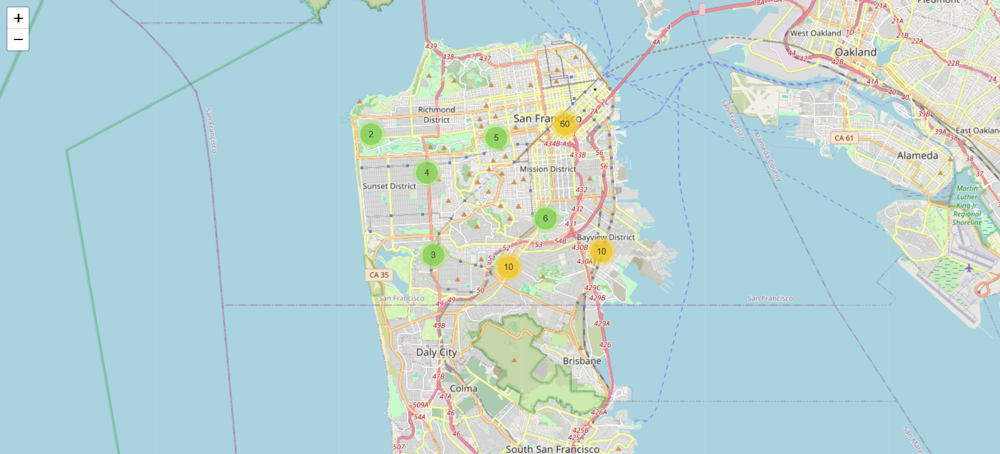

# GeospatialProject
# 🗺️ San Francisco Crime Incidents - Geospatial Data Visualization with Folium

This project is part of my Data Analyst learning journey and focuses on **visualizing crime incident data** in San Francisco using **Python**, **Pandas**, and **Folium**.

## 🔍 Project Overview

In this notebook, I created an interactive map that clusters crime incident markers based on their geographic coordinates. The result is a clear and interactive view of crime categories across the city.

## 📌 Tools & Libraries Used

- `Pandas`: Data manipulation
- `Folium`: Geospatial visualization
- `Folium.plugins.MarkerCluster`: To group nearby incidents
- `Jupyter Notebook`: For interactive coding and visualization

## 📊 Key Features

- Loads a dataset of incidents including latitude, longitude, and category.
- Initializes a Folium map centered on San Francisco.
- Adds each incident as a **clickable marker** to a **MarkerCluster** group.
- Displays category of each incident as a popup.

## 🌍 Sample Output

  
*(Optional: Include a screenshot of your map here for quick visual impact)*

## 📁 File

- `Geospatial Project.ipynb`: The main notebook file

## 📈 Potential Improvements

- Add time filtering to show changes over time
- Categorize incidents with different colored icons
- Connect with real-time data APIs
- Export final map to HTML for web sharing

## 👤 About Me

📫 Contact: tepegozersin@gmail.com  
🌍 Location: Antalya, Turkey  

---

## 💡 How to Run

1. Clone this repository:
   ```bash
   git clone https://github.com/tepegozersin/geospatial-crime-map.git
2. Open the notebook:
   jupyter notebook Geospatial\ Project.ipynb

Thanks for checking out my project!

