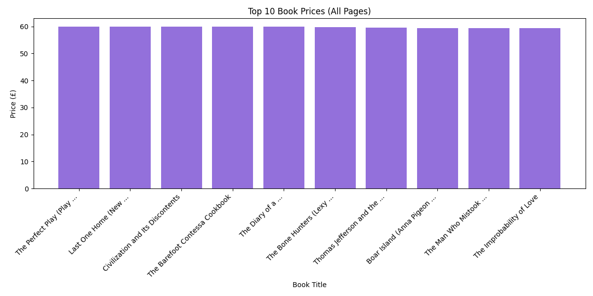

# 📚 Book Price Scraper (Paginated)

This project is a Selenium-based web scraper that extracts book data from [Books to Scrape](https://books.toscrape.com/), a practice site for scraping.  
It navigates through **all available pages**, collecting data about each book’s:

- 📖 Title  
- 💰 Price  
- 📦 Availability

Finally, it saves the data to a CSV file and generates a bar chart showing the **top 10 most expensive books**.

---

## 🛠️ Technologies Used

- Python 3.x
- Selenium WebDriver (Chrome)
- Pandas
- Matplotlib

---

## 📂 Files

- `scraper_2.py`: Main Python script for scraping and analysis  
- `books_paginated.csv`: Collected data in CSV format  
- `book_prices_paginated.png`: Bar chart of top 10 most expensive books  
- `README.md`: Project description and instructions  

---

## 📈 Sample Output



---

## 🚀 How It Works

1. Launches a Chrome browser using Selenium
2. Scrapes book info from each page using class/tag selectors
3. Follows pagination links (`li.next > a`) until no next page remains
4. Saves the data to `books_paginated.csv`
5. Creates a bar chart for the top 10 books based on price

---

## 📦 How to Run

> Make sure you have `chromedriver.exe` accessible in your project path or set in system PATH.

```bash
pip install selenium pandas matplotlib
python scraper_2.py
```

> You can also download ChromeDriver from: https://sites.google.com/a/chromium.org/chromedriver/
